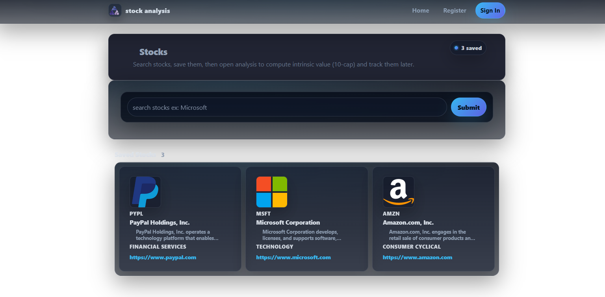
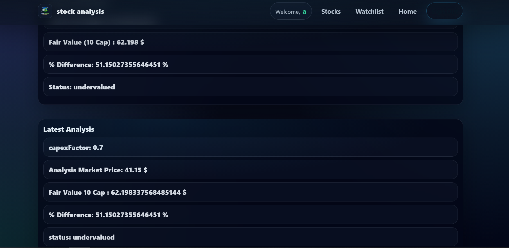
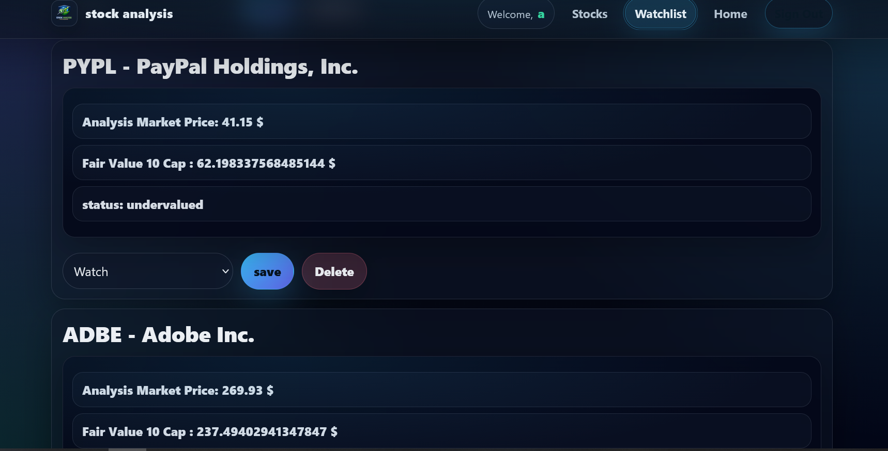
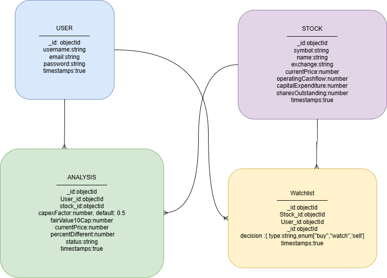

# Stock Analysis — 10-Cap Valuation App

## App Title & Description

**Stock Analysis** is a full-stack web application that helps users evaluate stocks using a **Buffett-style 10-cap valuation method**.
Users can search for public companies, analyze intrinsic value based on cash flow data, and save stocks to a personal watchlist to support long-term investment decisions.

This app is designed as an **educational financial analysis tool** and is not intended to provide investment advice.

---

## Screenshot(s)

### Landing / Stocks Page

### Analysis Page

### Watchlist Page

---

## Technologies Used

### Frontend
- React
- Vite
- React Router DOM
- Axios
- Bootstrap / React Bootstrap
- CSS

### Backend
- Node.js
- Express
- MongoDB
- Mongoose
- JSON Web Tokens (JWT)
- bcrypt
- dotenv
- cors
- morgan

### External API
- Financial Modeling Prep (FMP)

---

## Getting Started

### Project Planning

**ERD:**

---

### User Stories (MVP)

- As a user, I want to **sign up and log in** so I can save my data.
- As a user, I want to **search for stocks** by symbol or name.
- As a user, I want to **analyze a stock using a 10-cap valuation**.
- As a user, I want to **view valuation results clearly**.
- As a user, I want to **save stocks to a watchlist**.
- As a user, I want to **remove stocks from my watchlist**.

---

### Wireframes

- Landing / Stocks Page
- Stock Analysis Page
- Watchlist Page
- Authentication Pages

---

### ERD (Entity Relationship Diagram)

erDiagram
  USER ||--o{ ANALYSIS : creates
  USER ||--o{ WATCHLIST : owns
  STOCK ||--o{ ANALYSIS : analyzed
  STOCK ||--o{ WATCHLIST : tracked

  USER {
    string username
    string email
    string password
  }

  STOCK {
    string symbol
    string companyName
    number price
  }

  ANALYSIS {
    number fairValue
    number percentDifference
    string status
  }

  WATCHLIST {
    string decision
  }
